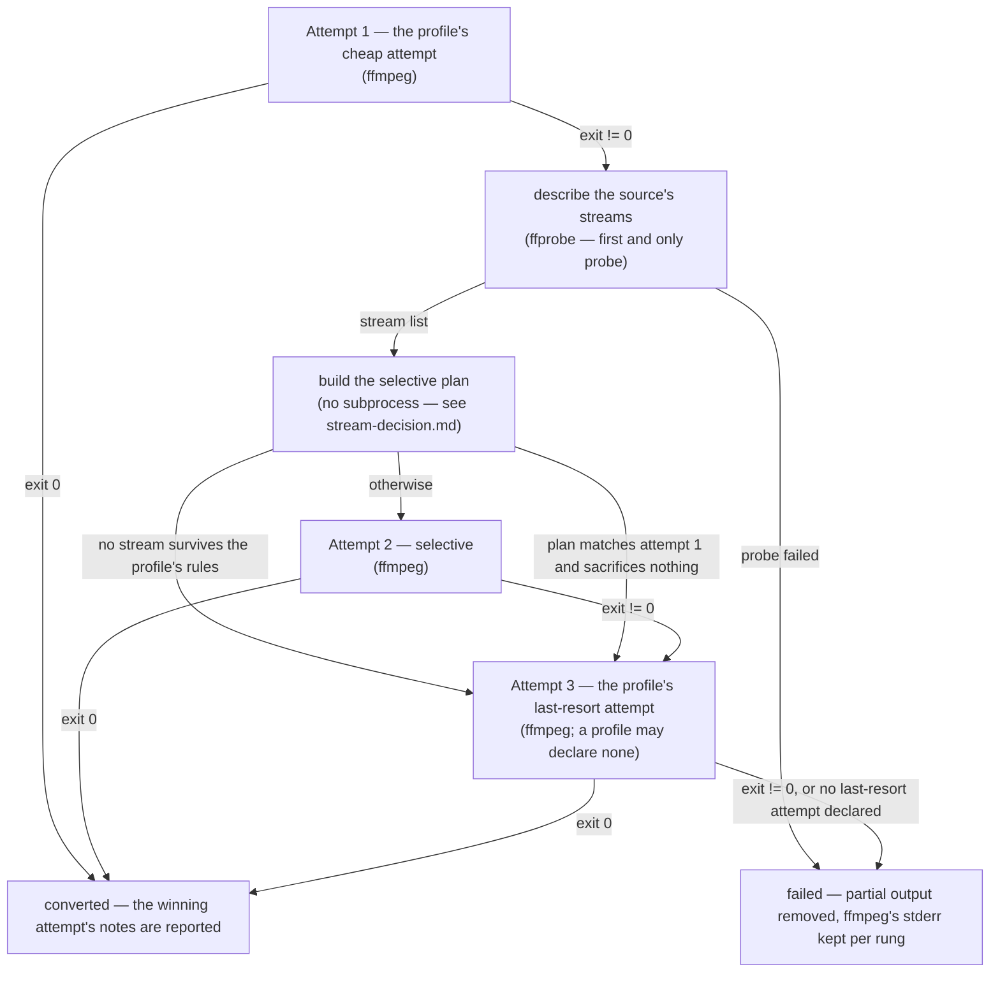

# Degradation ladder

> Design artifact (`docs/design.md`, `kind: concept`). One decision per diagram;
> the per-stream branch is a separate file, `stream-decision.md`. Referenced from
> the spec of every phase that changes the ladder — reference it, never restate it.

## The decision this settles

In which order the engine tries to produce one output file, where a subprocess is
spent, and which conditions move it down a rung. The point of the ladder is that
`ffprobe` never runs on the happy path (`docs/constitution.md`), so every node
that costs a process call is marked.

## Rules the diagram encodes

- **One probe per file, never on the happy path.** The `ffprobe` node sits behind
  the first non-zero exit and is reached at most once; every later rung reuses the
  same stream list.
- **Cheapest first.** Rung 1 is whatever the profile declares as its cheap attempt
  (a blind stream copy for a container that can hold the source codecs, an explicit
  single-stream decode where it cannot).
- **The selective rung is skipped when it would add nothing.** Two conditions do
  that: nothing survives the profile's rules (there is no command to build), or the
  plan keeps exactly the streams attempt 1 kept, with the same codecs, and gives up
  nothing worth naming. Without this rule a profile whose cheap attempt already maps
  streams explicitly would pay for a second, identical ffmpeg run.
- **The last rung is optional.** A container that can always be reached by a full
  re-encode declares one; a container with nothing further to give up (WAV) does not,
  and a failure there is the end of the ladder.
- **Every rung carries its own notes.** The notes of the attempt that actually
  succeeded are what the batch reports — the discarded rungs' notes are not.
