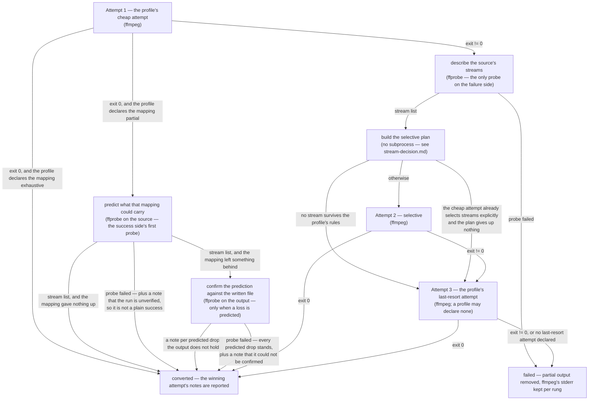

# Degradation ladder

> Design artifact (`docs/design.md`, `kind: concept`). One decision per diagram;
> the per-stream branch is a separate file, `stream-decision.md`. Referenced from
> the spec of every phase that changes the ladder — reference it, never restate it.

## The decision this settles

In which order the engine tries to produce one output file, where a subprocess is
spent, and which conditions move it down a rung. The point of the ladder is that
`ffprobe` stays off the happy path of an *exhaustive* cheap attempt
(`docs/constitution.md`), so every node that costs a process call is marked —
including the two nodes on the success side, which only a cheap attempt the
profile declares *partial by construction* ever reaches, and the second of which
only a run that is about to claim a loss ever reaches.

## Rules the diagram encodes

- **One probe per file, and none for an exhaustive cheap attempt — plus one more
  only for a run that is about to report a loss.** The failure-side `ffprobe`
  node sits behind the first non-zero exit and is reached at most once; every
  later rung reuses the same stream list. The success-side nodes are reached only
  when the profile declares its cheap attempt *partial by construction*, and the
  failure side and the success side are mutually exclusive — a file takes one
  path or the other. The second success-side probe, `C`, is the one exception to
  the one-probe count, and it is bounded by the claim it pays for: it runs only
  when `V` predicted at least one drop, so a conversion that gave nothing up
  still costs a single probe.
- **A predicted drop is confirmed against the output before it is reported.** A
  `-map` set says what ffmpeg was *asked* to carry, which is not the same as what
  the muxer wrote: MP4 and MOV regenerate a `tmcd` timecode track from the
  source's metadata although no selector names it (measured, ffmpeg 9.0), so the
  mapping alone reports a loss that did not happen — the false-positive half of
  the loss accounting `docs/vision.md` names as the USP (issue #66). `C` compares
  *counts per stream type* between the source and the written file, because a
  regenerated stream shares neither index nor codec name with its source, and
  attributes any surplus to that type's predicted drops in source order. Two
  properties make this safe in the direction the constitution cares about: a type
  with no surplus keeps every note it was given, and a probe that fails leaves
  the whole prediction standing rather than falling silent. The cost is that with
  several predicted drops of one type and only some of them surviving, the
  *count* of reported losses is right while the index named may not be —
  deliberately preferred over reporting a loss that did not happen, and never
  over the silence the constitution forbids.
- **A partial cheap attempt's success is verified, not assumed.** A mapping is
  partial by construction when it can leave source streams unmapped whatever the
  source turns out to contain: MP4's `-map 0:v? -map 0:a? -map 0:s?` selects no
  attachment and no data stream, WAV's `-map 0:a:0` selects no second audio
  stream. The profile declares this as data, exactly as it declares whether the
  attempt is stream-explicit — the engine never parses an option list to find
  out. The verification consults only the *structural* verdicts of
  `stream-decision.md` — is there a rule for this stream's type, and is the
  container already holding as many of that type as it can — never a codec-level
  one: ffmpeg exited 0, so whatever the attempt did with a codec worked, and
  naming a re-encode that never ran would trade one dishonest report for another.
- **What a partial profile owes in exchange.** Reading the declared rules instead
  of the option list is sound only while the rules and the mapping agree, so a
  profile that sets `partial_mapping` must satisfy the equality that soundness
  already rests on:

  `set(profile.rules) == set(mapped_types(profile))`

  where `mapped_types` is the stream types the cheap attempt's own option list
  maps — read directly off `-map`, exactly as `tests/test_profiles.py` computes
  it, and never by the engine, which is why the profile has to declare the two
  sides in agreement instead of the code deriving one from the other. The one
  exemption (issue #39) removes a type from both sides before comparing: one the
  cheap attempt maps only to *force a failure*, never to carry it on the success
  side, so it never reaches the success-side `V` checks and needs no rule to
  keep them honest. `mkv` and `mov` both map `-map 0:t?`, and the two resolve
  oppositely: MKV's muxer holds an attachment, so `mkv` carries fonts on the
  success side and `attachment` stays in the equality — drop the rule and every
  font it faithfully copied is reported as lost. MOV's muxer rejects any mapped
  attachment outright, so `mov` maps `0:t?` deliberately to make an
  attachment-bearing source fail the cheap attempt and land on the failure side
  instead — `attachment` is exempted from both sides, not carried on either
  (`docs/specs/archive/spec-video-formats.md`, issue #39). A new profile that cannot
  satisfy the equality, modulo that one exemption, is the bug — not the
  verification.

  The equality fails in either direction for a different reason:
  - **A mapped type with no rule** announces a drop that never happened — a
    stream the cheap attempt faithfully carried gets reported as lost.
  - **A rule for a type the cheap attempt does not map** announces nothing when
    it should: `_structural_drop` (`converter/jobs.py`) finds the rule, sees no
    stream-limit trip, and treats the stream as accepted, even though the cheap
    attempt never mapped that type at all — a stream that really was dropped
    produces no note. A hypothetical audio profile that maps audio only and
    still carries a `video` rule for cover art — the motivating case issue #40
    was filed against — is exactly this: it would silently drop the artwork
    (issue #18's bug class, reintroduced through the design contract). No
    shipped or planned profile is shaped that way today — `spec-audio-formats.md`
    resolved the opposite, that no audio profile declares a video rule at all,
    precisely to avoid this — but the contract has to forbid the shape outright
    rather than rely on every future profile happening to avoid it by
    discipline. This is why the clause once here admitting a `stream_limit` on
    "a type that does not map at all" is gone — such a rule cannot exist at all
    once the equality holds, so there was nothing left for that clause to
    permit.

  `stream_limit` adds one more constraint on top of the equality: **no
  `stream_limit` on a type its cheap attempt selects blindly, unless the
  container's own muxer enforces that same limit and rejects a surplus
  outright.** A blind `-map 0:a?` maps *every* audio stream, so a limit the
  mapping does not enforce would normally have the verification report
  surplus streams the output does contain. The one exception mirrors the
  force-failure exemption above rather than adding a new mechanism: `mp3` and
  `flac` (`docs/specs/archive/spec-audio-formats.md`) both map audio blindly yet
  declare `stream_limit=1`, because their muxers reject a second audio stream
  outright — measured, both exit non-zero — so a source that would trip the
  limit never reaches the success side at all; it fails the cheap attempt and
  lands on the failure side, where the declared limit drives the selective
  rung's own note instead. Outside that exception, a limit belongs to a type
  the cheap attempt names by index (WAV's `-map 0:a:0`), and matches the count
  of indices actually named — one index named, one stream, exactly WAV's
  `stream_limit=1`. The requirement runs the other way too: a type named by
  index *must* declare a limit equal to that count — without one,
  `_structural_drop` never trips and the verification accepts an unbounded
  number of that type's streams, the same false accept the equality above
  exists to rule out.

  The two shipped profiles satisfy the equality by construction — MP4's
  selectors match its three rules exactly and it declares no limit, WAV names
  one audio index and limits audio to 1 — and `tests/test_profiles.py` checks
  it per profile rather than leaving it to review. A mov-shaped profile in that
  same test corpus proves the force-failure exemption: it maps `attachment`
  with no rule for it and still passes, because the type is exempted on both
  sides as force-failure only, not because either direction of the check was
  skipped. An mp3-shaped profile proves the muxer-enforced `stream_limit`
  exemption the same way: it maps audio blindly and still carries
  `stream_limit=1`, because the mp3 muxer — not the mapping — is what turns a
  second audio stream into a failure.
- **Cheapest first.** Rung 1 is whatever the profile declares as its cheap attempt:
  a *blind* stream copy for a container that can hold the source codecs
  (`-map 0:v? -map 0:a? ...`), or a *stream-explicit* selection where it cannot
  (`-map 0:a:0 ...`). Which of the two it is, the profile declares — the engine
  never parses an option list to find out.
- **The selective rung is skipped when it would add nothing.** Two conditions do
  that. Nothing survives the profile's rules, so there is no command to build. Or
  the profile's cheap attempt is stream-explicit *and* the plan gives up nothing
  worth naming — then the rung would be a second, equivalent ffmpeg run. A profile
  whose cheap attempt is blind always gets the rung: the explicit per-stream
  mapping is exactly what can rescue a file the blind copy could not.
- **The last rung is optional.** A container that can always be reached by a full
  re-encode declares one; a container with nothing further to give up (WAV) does
  not, and a failure at the rung before it is then the end of the ladder.
- **Every rung carries its own notes.** The notes of the attempt that actually
  succeeded are what the batch reports — the discarded rungs' notes are not. Only
  the cheap attempt's notes are ever added to, and only by the two verification
  nodes above it; a later rung was built from the stream list itself, so its
  notes are already complete and it is never verified a second time.
- **Container-wide options are appended by the engine, once, at the end of every
  attempt.** The profile declares them in one place instead of repeating them in
  each attempt it declares.
