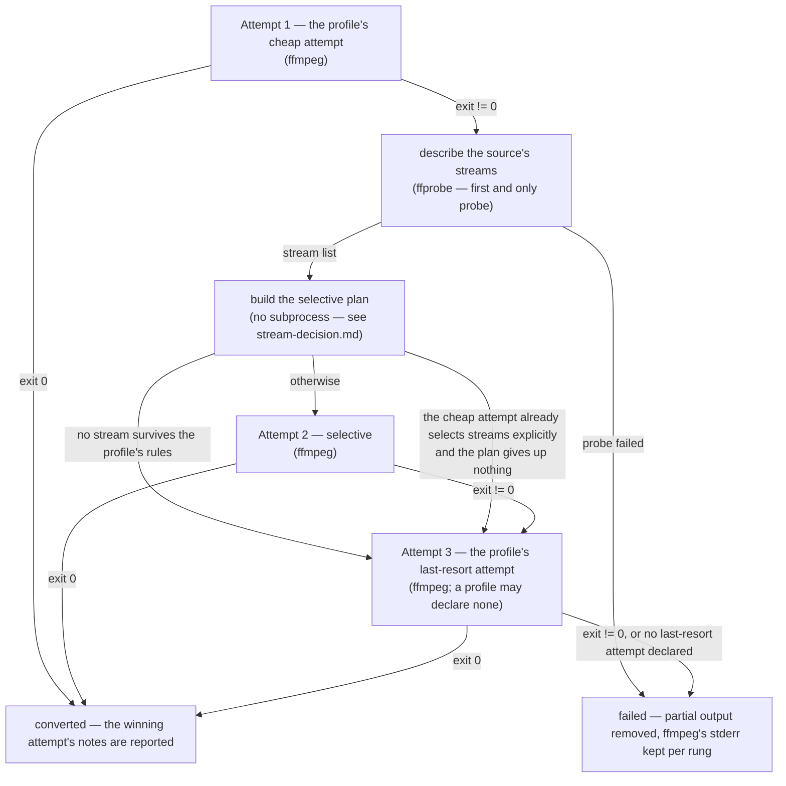

# Degradation ladder

> Design artifact (`docs/design.md`, `kind: concept`). One decision per diagram;
> the per-stream branch is a separate file, `stream-decision.md`. Referenced from
> the spec of every phase that changes the ladder — reference it, never restate it.

## The decision this settles

In which order the engine tries to produce one output file, where a subprocess is
spent, and which conditions move it down a rung. The point of the ladder is that
`ffprobe` never runs on the happy path (`docs/constitution.md`), so every node
that costs a process call is marked.

## Rules the diagram encodes

- **One probe per file, never on the happy path.** The `ffprobe` node sits behind
  the first non-zero exit and is reached at most once; every later rung reuses the
  same stream list.
- **Cheapest first.** Rung 1 is whatever the profile declares as its cheap attempt:
  a *blind* stream copy for a container that can hold the source codecs
  (`-map 0:v? -map 0:a? ...`), or a *stream-explicit* selection where it cannot
  (`-map 0:a:0 ...`). Which of the two it is, the profile declares — the engine
  never parses an option list to find out.
- **The selective rung is skipped when it would add nothing.** Two conditions do
  that. Nothing survives the profile's rules, so there is no command to build. Or
  the profile's cheap attempt is stream-explicit *and* the plan gives up nothing
  worth naming — then the rung would be a second, equivalent ffmpeg run. A profile
  whose cheap attempt is blind always gets the rung: the explicit per-stream
  mapping is exactly what can rescue a file the blind copy could not.
- **The last rung is optional.** A container that can always be reached by a full
  re-encode declares one; a container with nothing further to give up (WAV) does
  not, and a failure at the rung before it is then the end of the ladder.
- **Every rung carries its own notes.** The notes of the attempt that actually
  succeeded are what the batch reports — the discarded rungs' notes are not.
- **Container-wide options are appended by the engine, once, at the end of every
  attempt.** The profile declares them in one place instead of repeating them in
  each attempt it declares.
