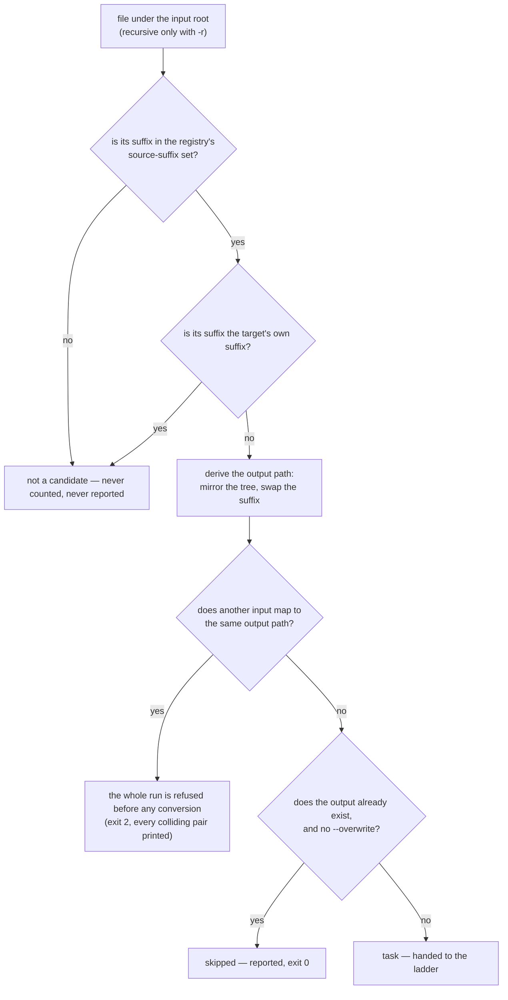

# Source selection

> Design artifact (`docs/design.md`, `kind: concept`). The third diagram, next to
> `degradation-ladder.md` (the order of attempts) and `stream-decision.md` (one
> stream's fate). This one decides which files under the input root become tasks
> at all — the question `--to <format>` creates and every coverage phase re-opens
> by adding suffixes to the set.
>
> Declared deviation from `docs/design.md`'s per-stream convention: this is not a
> per-stream decision, so it follows the *attempt ladder* rules instead — every
> edge labelled with its condition, and the one node that costs a subprocess
> marked.

## The decision this settles

Given an input root and a target format, which files are converted, which are
refused before any process starts, and which are silently not candidates at all.
Nothing here spends a subprocess call: selection is finished before ffmpeg is
ever located.

## Rules the diagram encodes

- **A file that is not a media file is not a candidate**, not a failure. The
  set of source suffixes is curated data in the profile registry, for the same
  reason the copy mask is (`docs/prior-art.md`): ffmpeg can be asked what it
  contains, never what it will accept. A tree full of `.txt` and `.nfo` produces
  no work and no noise.
- **A file already in the target format is not a candidate either.** Its output
  path would be its own input path, which is not a conversion — and under
  `--overwrite` it would be ffmpeg reading and writing one file at once. This is
  the rule that makes `--to <format>` safe to point at a mixed tree.
- **Collisions are refused for the whole run, never per file.** Two sources that
  differ only in suffix (`ep1.mkv`, `ep1.avi`) map to one output. Refusing up
  front (exit 2) keeps the run from converting half a tree and then discovering
  the conflict — the existing behaviour, unchanged by the target-driven CLI, and
  the reason it now matters more: one target draws in far more sources than one
  format pair did.
- **Skipped is a reported outcome; not-a-candidate is not.** A file that was
  already converted is counted in the summary, because "0 converted, 12 skipped"
  is the idempotent-re-run evidence the vision promises. A `.txt` is not counted,
  because a count of everything the directory happens to hold means nothing.
- **Selection completes before ffmpeg is located.** `--dry-run` therefore works
  on a machine with no ffmpeg installed, and a collision is reported without one.
