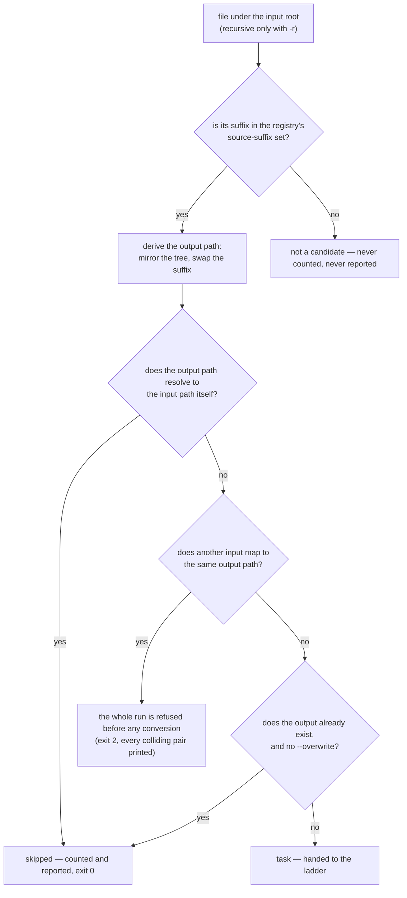

# Source selection

> Design artifact (`docs/design.md`, `kind: concept`). The third diagram, next to
> `degradation-ladder.md` (the order of attempts) and `stream-decision.md` (one
> stream's fate). This is the batch-item state flow `docs/design.md` names as the
> secondary decision a diagram may settle — extended one step upstream, to the
> question `--to <format>` creates: which files become items at all. Every
> coverage phase reopens it by adding suffixes to the set.

## The decision this settles

Given an input root and a target format, which files are converted, which are
refused before any process starts, and which are never candidates. **No node in
this diagram spends a subprocess call** — that is the point of drawing it:
selection is complete before ffmpeg is even located, which is what lets
`--dry-run` and a collision refusal work on a machine with no ffmpeg installed.

## Rules the diagram encodes

- **A file that is not a media file is not a candidate**, not a failure. The set
  of source suffixes is curated data in the profile registry, for the same reason
  the copy mask is (`docs/prior-art.md`): ffmpeg can be asked what it contains,
  never what it will accept. A tree full of `.txt` and `.nfo` produces no work and
  no noise.
- **The self-write guard is about the path, not the suffix.** A source is excluded
  only when its derived output path *is* its input path — comparing with the same
  case-folding the collision check uses, because Windows would otherwise let
  `A.MP4` and `a.mp4` be two names for one file. Excluding every file that merely
  shares the target's suffix would be wrong: with a separate output root,
  `In\a.mp4` -> `Out\a.mp4` is a legitimate remux, and dropping it would leave the
  output tree quietly incomplete.
- **A self-write is reported, never silently dropped.** It leaves the run as a
  counted `skipped` with a reason, because a file the user pointed at and did not
  get is exactly what `docs/constitution.md` forbids passing over in silence.
- **Collisions are refused for the whole run, never per file.** Two sources that
  differ only in suffix (`ep1.mkv`, `ep1.avi`) map to one output. Refusing up front
  keeps the run from converting half a tree and then discovering the conflict —
  existing behaviour, and it matters more now that one target draws in many more
  sources than one format pair did.
- **Skipped is a reported outcome; not-a-candidate is not.** An already-converted
  file is counted, because `0 converted, 12 skipped` is the idempotent-re-run
  evidence the vision promises. A `.txt` is not, because counting everything a
  directory happens to hold means nothing.
- **Selection cannot tell whether a source can *produce* the target.** Whether a
  video-only file has audio to put in a WAV is only knowable from a probe, and a
  probe on the happy path is forbidden. That question therefore belongs to the
  ladder, not here — see `degradation-ladder.md` and the spec that owns the
  outcome it ends in.
