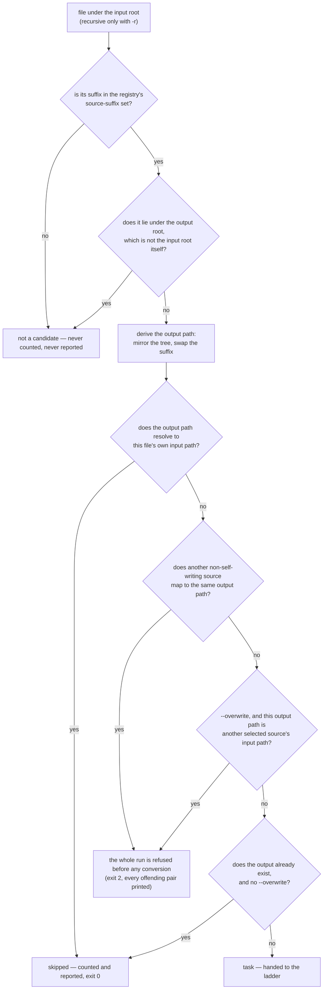

# Source selection

> Design artifact (`docs/design.md`, `kind: concept`). The third diagram, next to
> `degradation-ladder.md` (the order of attempts) and `stream-decision.md` (one
> stream's fate). This is the batch-item state flow `docs/design.md` names as the
> secondary decision a diagram may settle — extended one step upstream, to the
> question `--to <format>` creates: which files become items at all. Every
> coverage phase reopens it by adding suffixes to the set.

## The decision this settles

Given an input root and a target format, which files are converted, which are
refused before any process starts, and which are never candidates. **No node in
this diagram spends a subprocess call** — that is the point of drawing it:
selection is complete before ffmpeg is even located, which is what lets
`--dry-run` and a collision refusal work on a machine with no ffmpeg installed.

## Rules the diagram encodes

- **A file that is not a media file is not a candidate**, not a failure. The set
  of source suffixes is curated data in the profile registry, for the same reason
  the copy mask is (`docs/prior-art.md`): ffmpeg can be asked what it contains,
  never what it will accept. A tree full of `.txt` and `.nfo` produces no work and
  no noise.
- **The tool's own output tree is not an input.** A nested output root
  (`--to mp4 -r D:\Media D:\Media\converted`) is the natural invocation, and
  without this rule it never converges: run 2 would find `converted\a.mp4`, write
  `converted\converted\a.mp4`, and every run would add one more generation while
  reporting `1 converted`. Excluding what lies under the output root is what makes
  a re-run reach `0 converted`. The exception is an output root that resolves to
  the input root itself — there everything would be excluded, and the self-write
  rule below is the one that answers the question instead.
- **The self-write guard is about the path, not the suffix.** A source is excluded
  only when its derived output path *is* its input path. Both sides are resolved
  before they are compared, and then compared case-folded — unlike
  `paths.find_collisions`, which case-folds the paths **as given**. The difference
  is load-bearing: `--mirror-to` derives the output root from a resolved input
  path while discovery returns paths built from the root as typed, so comparing as
  given would miss the self-write. The guard resolves the output path the same way
  the write will see it; note that a bare-drive `OUTPUT` (`converter --to mp4 IN
  E:`) is drive-relative by construction, so it resolves against the current
  directory on `E:` — `--mirror-to E:` is the spelling that normalises it, which is
  what `paths.mirror_to_drive`'s docstring exists to explain.
- Excluding every file that merely shares the target's suffix would be wrong in
  the other direction: with a separate output root, `In\a.mp4` -> `Out\a.mp4` is a
  legitimate remux, and dropping it would leave the output tree quietly incomplete.
- **A self-write is reported, never silently dropped**, and it does **not** refuse
  the run. It leaves the run as a counted `skipped` with a reason, because a file
  the user pointed at and did not get is exactly what `docs/constitution.md`
  forbids passing over in silence — and because converting a tree in place must
  stay idempotent: `--to mp4 IN IN` over an already-converted directory reports
  `0 converted, N skipped`, exit 0, which `docs/vision.md` requires.
- **Collisions are refused for the whole run, never per file.** Two sources that
  differ only in suffix (`ep1.mkv`, `ep1.avi`) map to one output. Refusing up front
  keeps the run from converting half a tree and then discovering the conflict —
  existing behaviour, and it matters more now that one target draws in many more
  sources than one format pair did. A self-writing source is not counted here: it
  produces no conversion, so it cannot contend for its own path.
- **The destructive case is `--overwrite`, and only that.** With `IN` as its own
  output and both `a.mkv` and `a.mp4` present, `a.mp4` is skipped as a self-write
  and `a.mkv` wants to write over it. Without `--overwrite` nothing happens —
  `a.mkv` sees an existing output and is skipped too. With `--overwrite` the run
  would report a file as kept and then destroy it, so the run is refused up front
  and names both files. Refusing only under `--overwrite` is what keeps the
  harmless in-place re-run from exiting 2.
- **Skipped is a reported outcome; not-a-candidate is not.** An already-converted
  file is counted, because `0 converted, 12 skipped` is the idempotent-re-run
  evidence the vision promises. A `.txt`, or a file inside the output tree, is not,
  because counting everything a directory happens to hold means nothing.
- **Selection cannot tell whether a source can *produce* the target.** Whether a
  video-only file has audio to put in a WAV is only knowable from a probe, and a
  probe on the happy path is forbidden. That question belongs to the ladder, not
  here — see `degradation-ladder.md` and the spec that owns the outcome it ends in.
