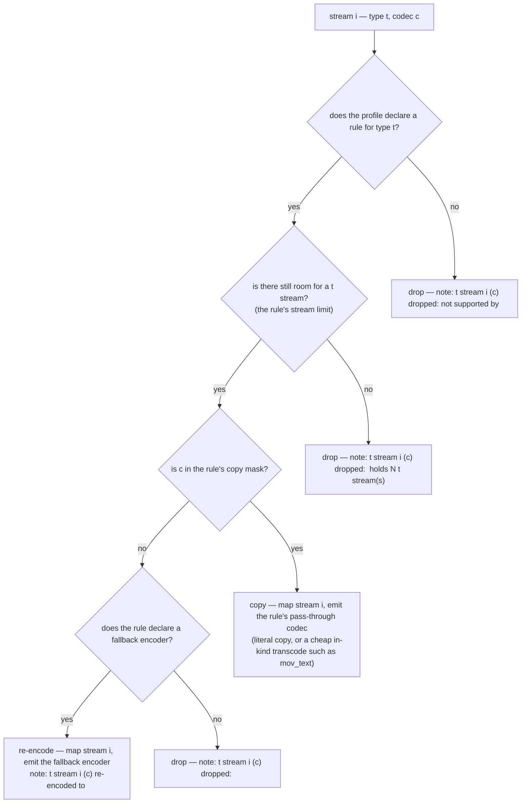

# Per-stream decision

> Design artifact (`docs/design.md`, `kind: concept`). The sibling of
> `degradation-ladder.md`: that file decides the order of attempts, this one
> decides what happens to a single stream inside the selective rung.

## The decision this settles

Given one probed stream and the target profile's rule for that stream's type,
whether the stream is copied, re-encoded, or dropped — and what the resulting
note says. No node here spends a subprocess call: the whole plan is built in
Python from one stream list.

## Rules the diagram encodes

- **Three outcomes, never a fourth.** A stream is copied, re-encoded, or dropped.
  Every drop edge names the reason, because a silent drop is exactly what the
  vision forbids.
- **Every note names three things:** the stream index, that stream's codec, and
  what was given up (`docs/vision.md`). A note that omits one of them is a review
  finding.
- **Output specifiers count per type, in mapping order.** The position used in
  `-c:v:0`, `-c:a:1` is the count of streams of that type already kept, not the
  input stream index — ffmpeg counts output streams per type.
- **The copy mask is curated, never discovered.** `ffmpeg -codecs` lists what a
  build contains, not what a muxer legally accepts (`docs/prior-art.md`,
  "Container/codec capability modelling"), so the mask is data written by hand.
- **A missing rule is a drop, not a crash.** Attachments, data and timecode
  streams reach the default branch and are dropped with a note; the ladder never
  fails because a source carried an unexpected stream type.
