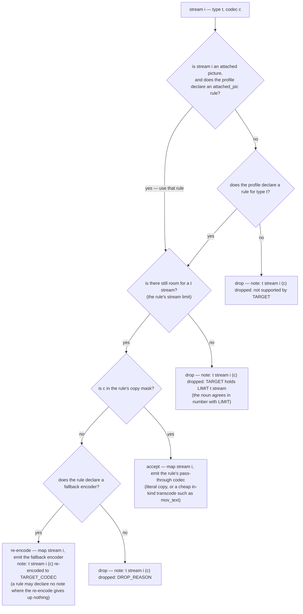

# Per-stream decision

> Design artifact (`docs/design.md`, `kind: concept`). The sibling of
> `degradation-ladder.md`: that file decides the order of attempts, this one
> decides what happens to a single stream inside the selective rung.
>
> Declared deviation from `docs/design.md`'s per-stream convention: the contract
> asks for one decision node per stream type. A profile-driven engine has no
> per-type code — video, audio and subtitle differ only in the rule they carry —
> so the branch is drawn once, type-agnostically, and the contract bullet was
> amended in the same PR to allow it.

## The decision this settles

Given one probed stream and the target profile's rule for that stream's type,
whether the stream is copied, re-encoded, or dropped — and what the resulting
note says. No node here spends a subprocess call: the whole plan is built in
Python from one stream list. `TARGET` below is the profile's display label
(`MP4`, `WAV`), `TARGET_CODEC` the human-readable name of what the fallback
encoder produces (`h264`, `aac`), `DROP_REASON` the reason the rule declares.

## Rules the diagram encodes

- **Disposition is checked before type.** An attached picture is a video stream
  by `codec_type`, so a profile that can hold artwork but not video would
  otherwise have to choose between carrying both and dropping both. The rule is
  resolved by disposition first, falling back to the type — and a profile that
  declares no `attached_pic` rule is unaffected, since the fallback is what it
  already did. The engine still counts a carried picture under `video`, because
  ffmpeg numbers it as a video output stream.
- **Three outcomes, never a fourth.** A stream is accepted, re-encoded, or
  dropped. Every drop edge names the reason, because a silent drop is exactly
  what the vision forbids.
- **Every note names three things:** the stream index, that stream's codec, and
  what was given up (`docs/vision.md`). A note that omits one of them is a review
  finding. A stream with no codec name reported by ffprobe reads as `unknown`.
  The one note that names no stream is the ladder's *unverified-run* note, which
  exists precisely because no stream list could be obtained
  (`degradation-ladder.md`); it reports the absence of the facts this rule
  demands, and is not a per-stream verdict at all. An advisory
  (`docs/specs/archive/spec-lossy-source-notes.md`) is exempt on the same footing: it
  names the stream and its codec, but what it reports is the source's own
  history, not this conversion's sacrifice, so it is not bound by this rule the
  way a degradation note is (`docs/constitution.md`'s degradation-note/advisory
  distinction).
- **A re-encode that gives up nothing carries no note.** Decoding to a container's
  only codec is the definition of that target format, not a loss — WAV's PCM rule
  declares no note, MP4's `aac` and `h264` fallbacks do. Whether the note exists
  is the rule's data, never an engine heuristic.
- **Output specifiers count per type, in mapping order.** Where a rule's option
  template carries the position placeholder, the value substituted into
  `-c:v:0`, `-c:a:1` is the count of streams of that type already kept, not the
  input stream index — ffmpeg counts output streams per type. The placeholder is
  optional: a rule whose stream limit is 1 can only ever produce one output stream
  of its type, so it writes the bare specifier (`-c:a`) and the engine substitutes
  nothing.
- **The rung is emitted as maps, then codecs, then container options.** All
  `-map` pairs first in stream order, then every codec option in the same order,
  then the profile's container-wide options. Interleaving per stream would be
  equally valid ffmpeg and a different argv.
- **The copy mask is curated, never discovered.** `ffmpeg -codecs` lists what a
  build contains, not what a muxer legally accepts (`docs/prior-art.md`,
  "Container/codec capability modelling"), so the mask is data written by hand.
  A mask may legitimately be empty — WAV accepts no source codec as-is.
- **A missing rule is a drop, not a crash.** Attachments, data and timecode
  streams reach the default branch and are dropped with a note; the ladder never
  fails because a source carried an unexpected stream type.
